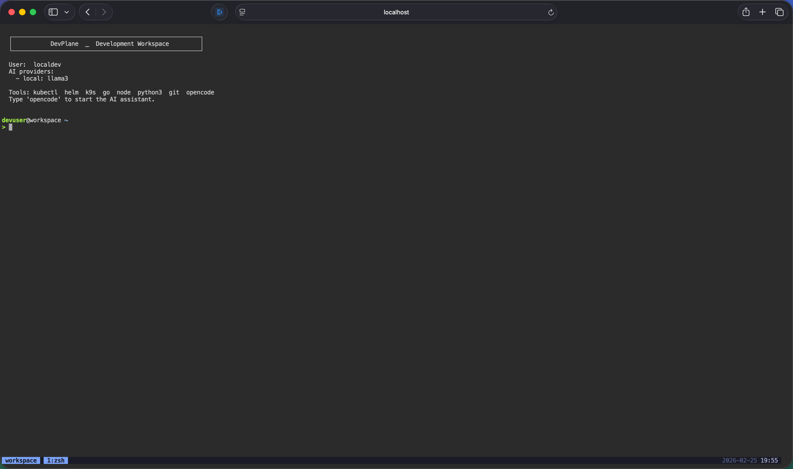

# DevPlane

> Browser-based AI coding workspaces on Kubernetes — air-gap friendly, OIDC secured, one Helm install.

[](https://github.com/SPJDevOps/DevPlane/actions/workflows/ci.yml)
[](https://github.com/SPJDevOps/DevPlane/releases)
[](./hack/boilerplate.go.txt)
[](https://go.dev)




---

## What is this?

Most teams that need AI-assisted development in restricted environments (air-gapped data centres, regulated industries, enterprise private clouds) end up with one of two bad outcomes: they either punch holes in the perimeter to reach a hosted AI API, or they give up on AI tooling entirely.

DevPlane takes a third path: a Kubernetes operator that provisions **isolated, browser-accessible terminal workspaces** for each user, pre-wired to whatever OpenAI-compatible LLM endpoint you already run on-cluster (vLLM, Ollama, LM Studio — anything). Users log in via your existing OIDC provider, get a persistent tmux session in the browser, and an AI coding assistant ([opencode](https://opencode.ai)) that talks only to your internal model. No VPN, no SSH keys, no data leaving the cluster.

Platform and infra teams get an equally important benefit: **developer access is policy-as-code**. NetworkPolicies are auto-generated per workspace from values your team controls centrally — which external ports are reachable, which in-cluster services developers can call, and how much CPU/memory/storage each workspace gets. There is no shared-box drift, no stale SSH keys to revoke, and no developer who can accidentally (or deliberately) reach a production database because their local environment happened to have the right network route.

---

## Features

- **Fully browser-based** — ttyd serves the terminal over WebSocket; nothing to install on the developer's machine
- **OIDC authentication** — plug in Keycloak, Dex, Okta, or any compliant IdP; the gateway handles the OAuth2 flow and derives workspace identity from token claims
- **Per-user isolated workspaces** — each user gets their own Pod, PVC, and headless Service with strict NetworkPolicies (deny-all default, egress only to your LLM namespace)
- **Persistent storage** — a dedicated PVC per user survives pod restarts and idle-timeout evictions; code and config are never lost
- **Automatic idle-timeout and self-service recovery** — the operator stops idle pods and the gateway transparently restarts them on the user's next login, with no manual intervention
- **Any OpenAI-compatible LLM** — vLLM, Ollama, LM Studio, or a remote API; configure multiple providers and let opencode switch between them
- **Infra-team governance by default** — egress ports, reachable in-cluster namespaces, and resource limits are all set centrally by your platform team and enforced as Kubernetes NetworkPolicies and ResourceQuotas; developers cannot exceed or work around them. OIDC identity means no SSH key sprawl and instant access revocation when someone leaves the team.
- **Hardened pod security** — non-root (`UID 1000`), read-only root filesystem, all capabilities dropped, `seccompProfile: RuntimeDefault`, no privileged mode
- **Air-gap ready** — mirror three images to your internal registry, point the Helm values at them, done
- **Private CA support** — mount a CA bundle once in Helm; it propagates to both the gateway (OIDC validation) and every workspace pod (git, curl, npm, Python requests)
- **Multi-arch images** — `linux/amd64` + `linux/arm64` published to GHCR for every release

---

## Architecture

```
                    ┌─────────────────────────────────────────────────────────────┐
                    │                     Kubernetes Cluster                        │
                    │                                                               │
  User Browser      │   ┌─────────────┐     ┌──────────────┐     ┌─────────────┐  │
  (HTTPS/WSS)       │   │   Ingress   │────▶│   Gateway    │────▶│  Operator   │  │
  ────────────────▶ │   │ (optional)  │     │ OIDC + Proxy │     │ (controller)│  │
                    │   └─────────────┘     └──────┬───────┘     └──────┬──────┘  │
                    │                               │                    │          │
                    │                               │ create/get        │ watch    │
                    │                               │ Workspace CR      │ Workspace│
                    │                               ▼                    ▼          │
                    │                        ┌──────────────┐     ┌─────────────┐  │
                    │                        │  Workspace   │     │  Workspace  │  │
                    │                        │     CRs      │◀────│    Pod +    │  │
                    │                        │  (per user)  │     │  PVC + Svc  │  │
                    │                        └──────┬───────┘     └─────────────┘  │
                    │                               │                               │
                    │                               │ WebSocket proxy               │
                    │                               ▼                               │
                    │                        ┌──────────────┐                       │
                    │                        │  Workspace   │                       │
                    │                        │  Pod (ttyd + │                       │
                    │                        │  tmux +      │                       │
                    │                        │  opencode)   │                       │
                    │                        └──────┬───────┘                       │
                    │                               │ egress only                   │
                    │                               ▼                               │
                    │                        ┌──────────────┐                       │
                    │                        │  vLLM / LLM  │  (in-cluster)        │
                    │                        └──────────────┘                       │
                    └─────────────────────────────────────────────────────────────┘
```

Three components ship as separate images:

| Component | Role |
|-----------|------|
| **Operator** | Watches `Workspace` CRDs; reconciles Pod, PVC, Service, ServiceAccount, NetworkPolicies per user. Stateless. |
| **Gateway** | Single user-facing entrypoint. Handles OIDC login, creates/gets Workspace CRs, proxies WebSocket to the user's pod. |
| **Workspace Pod** | Ubuntu 24.04 + ttyd + tmux + opencode. Non-root, read-only root FS. Env vars from the CR wire opencode to the LLM. |

See [ARCHITECTURE.md](./ARCHITECTURE.md) for the full auth flow and security model.

---

## Quick Start

### Prerequisites

- Kubernetes 1.27+
- Helm 3.10+
- An OIDC-compatible identity provider (Keycloak, Dex, Okta, Azure AD, …)
- An OpenAI-compatible LLM endpoint reachable from the cluster — optional, workspaces work without one

### 1. Install with Helm

```bash
helm repo add devplane https://spjdevops.github.io/DevPlane
helm repo update

helm install workspace-operator devplane/workspace-operator \
  --version 1.1.2 \
  --namespace workspace-operator-system \
  --create-namespace \
  --set gateway.oidc.issuerURL=https://idp.example.com \
  --set gateway.oidc.clientID=devplane \
  --set gateway.oidc.clientSecret=<your-client-secret> \
  --set gateway.oidc.redirectURL=https://devplane.example.com/callback \
  --set 'workspace.ai.providers[0].name=local' \
  --set 'workspace.ai.providers[0].endpoint=http://vllm.ai-system.svc:8000' \
  --set 'workspace.ai.providers[0].models[0]=deepseek-coder-33b-instruct'
```

### 2. Verify

```bash
# Operator and gateway should be Running
kubectl get pods -n workspace-operator-system

# CRD installed
kubectl get crd workspaces.workspace.devplane.io
```

### 3. Open the browser

Navigate to the URL you configured as `gateway.oidc.redirectURL` (minus `/callback`). You will be redirected to your IdP, and after login the gateway provisions your workspace and drops you into a browser terminal — no separate token, no VPN, no SSH key.

### Air-gapped clusters

Mirror the three images to your internal registry before installing:

```bash
REGISTRY=registry.example.com/devplane
VERSION=1.1.2

for img in workspace-operator workspace-gateway workspace; do
  docker pull ghcr.io/spjdevops/devplane/${img}:${VERSION}
  docker tag  ghcr.io/spjdevops/devplane/${img}:${VERSION} ${REGISTRY}/${img}:${VERSION}
  docker push ${REGISTRY}/${img}:${VERSION}
done
```

Then override in your values file:

```yaml
operator:
  image:
    repository: registry.example.com/devplane/workspace-operator
    tag: "1.1.2"
gateway:
  image:
    repository: registry.example.com/devplane/workspace-gateway
    tag: "1.1.2"
workspace:
  image:
    repository: registry.example.com/devplane/workspace
    tag: "1.1.2"
```

---

## Published Images

Multi-arch (`linux/amd64` + `linux/arm64`) images are published to GHCR on every release:

| Image | Pull reference |
|-------|----------------|
| Operator  | `ghcr.io/spjdevops/devplane/workspace-operator:1.1.2` |
| Gateway   | `ghcr.io/spjdevops/devplane/workspace-gateway:1.1.2`  |
| Workspace | `ghcr.io/spjdevops/devplane/workspace:1.1.2`          |

Helm chart: [https://spjdevops.github.io/DevPlane](https://spjdevops.github.io/DevPlane) — [index.yaml](https://spjdevops.github.io/DevPlane/index.yaml) · [GitHub Releases](https://github.com/SPJDevOps/DevPlane/releases)

---

## Configuration

### AI providers

Configure one or more OpenAI-compatible backends. Each user's workspace gets all providers injected as environment variables; opencode lets them switch between them.

```yaml
workspace:
  ai:
    providers:
      - name: local-vllm
        endpoint: "http://vllm.ai-system.svc:8000"
        models:
          - deepseek-coder-33b-instruct
      - name: ollama
        endpoint: "http://ollama.ai-system.svc:11434"
        models:
          - codellama:13b
    egressNamespaces: ai-system   # in-cluster namespaces workspace pods may reach
    egressPorts: "22,80,443,8000,11434"  # external TCP ports allowed in egress policy
```

### Private CA certificates

If your IdP or internal services use a private CA, create a ConfigMap with the PEM bundle and reference it in values — the chart mounts it in the gateway and the operator propagates it to every workspace pod automatically:

```yaml
gateway:
  tls:
    customCABundle:
      configMapName: devplane-ca-bundle   # namespace: workspace-operator-system
```

See [docs/deployment.md](./docs/deployment.md) for the full values reference, production hardening checklist, upgrade/rollback notes, and observability setup.

### NetworkPolicy egress ports

By default each workspace pod is allowed egress on:

| Port | Purpose |
|------|---------|
| 22 | Git over SSH |
| 80, 443 | HTTP / HTTPS |
| 5000 | Self-hosted Docker registry |
| 8000 | vLLM |
| 8080, 8081 | Nexus, Artifactory, generic alt-HTTP |
| 11434 | Ollama |

Override per-cluster (`workspace.ai.egressPorts` in values) or per-workspace (`spec.aiConfig.egressPorts` on the CR). Changes take effect on the next reconcile.

---

## Troubleshooting

| Symptom | Fix |
|---------|-----|
| CRD not found | `make manifests && make install` or apply `config/crd/bases/` |
| Pod stays `Pending` | Check PVC binding and StorageClass; check resource quotas |
| Gateway 401 errors | Verify `issuerURL` matches the `iss` claim exactly; check NTP sync |
| Workspace can't reach LLM | Ensure LLM namespace is in `egressNamespaces`; check NetworkPolicy with `kubectl get netpol -n workspaces` |
| Workspace can't reach external service | Add the required port to `egressPorts` |
| OIDC TLS errors | Mount a CA bundle — see [Private CA certificates](./docs/deployment.md#private--self-signed-ca-certificates) |

---

## Development

```bash
git clone https://github.com/SPJDevOps/DevPlane.git
cd DevPlane
go mod download

make generate    # generate deepcopy methods
make manifests   # generate CRD + RBAC YAML
make test        # unit tests + envtest integration tests (70% coverage enforced)
make lint        # golangci-lint
make build       # compile operator binary
make run         # run operator locally against current kubeconfig
```

Run a single test:

```bash
go test -run TestIsPodReady ./controllers
go test -run TestBuildPod ./pkg/workspace
```

For a full local walkthrough (workspace image with Docker, full stack with KIND), see [docs/local-development.md](./docs/local-development.md).

### Directory layout

```
api/v1alpha1/      Workspace CRD types and generated code
controllers/       Workspace reconciliation logic
cmd/gateway/       Gateway entrypoint
pkg/gateway/       Gateway HTTP handlers (auth, lifecycle, proxy)
pkg/security/      RBAC and NetworkPolicy helpers
config/            CRD, RBAC, manager manifests, CR samples
deploy/helm/       Helm chart
hack/              Boilerplate and workspace entrypoint script
```

### Makefile targets

| Target | Description |
|--------|-------------|
| `make manifests` | Generate CRDs and RBAC from annotations |
| `make generate` | Generate deepcopy methods |
| `make test` | Run all tests with coverage |
| `make lint` | Run golangci-lint |
| `make build` | Build operator binary |
| `make docker-build` | Build all three images |
| `make deploy` | Deploy with kustomize |

---

## License

Apache 2.0 — see [hack/boilerplate.go.txt](./hack/boilerplate.go.txt).
