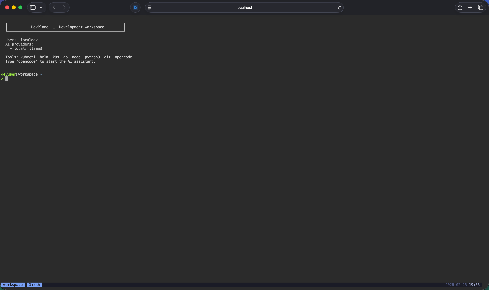

# DevPlane

> Browser-based AI coding workspaces on Kubernetes — air-gap friendly, OIDC secured, one Helm install.

[](https://github.com/SPJDevOps/DevPlane/actions/workflows/ci.yml)
[](https://github.com/SPJDevOps/DevPlane/actions/workflows/helm-smoke.yml)
[](https://github.com/SPJDevOps/DevPlane/releases)
[](./hack/boilerplate.go.txt)
[](https://go.dev)




---

## What is this?

Most teams that need AI-assisted development in restricted environments (air-gapped data centres, regulated industries, enterprise private clouds) end up with one of two bad outcomes: they either punch holes in the perimeter to reach a hosted AI API, or they give up on AI tooling entirely.

DevPlane takes a third path: a Kubernetes operator that provisions **isolated, browser-accessible terminal workspaces** for each user, pre-wired to whatever OpenAI-compatible LLM endpoint you already run on-cluster (vLLM, Ollama, LM Studio — anything). Users log in via your existing OIDC provider, get a persistent tmux session in the browser, and an AI coding assistant ([opencode](https://opencode.ai)) that talks only to your internal model. No VPN, no SSH keys, no data leaving the cluster.

Platform and infra teams get an equally important benefit: **developer access is policy-as-code**. NetworkPolicies are auto-generated per workspace from values your team controls centrally — which external ports are reachable, which in-cluster services developers can call, and how much CPU/memory/storage each workspace gets. There is no shared-box drift, no stale SSH keys to revoke, and no developer who can accidentally (or deliberately) reach a production database because their local environment happened to have the right network route.

---

## Features

- **Fully browser-based** — ttyd serves the terminal over WebSocket; nothing to install on the developer's machine
- **OIDC authentication** — plug in Keycloak, Dex, Okta, or any compliant IdP; the gateway handles the OAuth2 flow and derives workspace identity from token claims
- **Per-user isolated workspaces** — each user gets their own Pod, PVC, and headless Service with strict NetworkPolicies (deny-all default, egress only to your LLM namespace)
- **Persistent storage** — a dedicated PVC per user survives pod restarts and idle-timeout evictions; code and config are never lost
- **Automatic idle-timeout and self-service recovery** — the operator stops idle pods (default `24h` without gateway activity; override per cluster via Helm `workspace.idleTimeout` / operator `IDLE_TIMEOUT`, or per Workspace with `spec.lifecycle.idleTimeout`, use `"0"` to opt out) and the gateway transparently restarts them on the user's next login, with no manual intervention
- **Any OpenAI-compatible LLM** — vLLM, Ollama, LM Studio, or a remote API; configure multiple providers and let opencode switch between them
- **Infra-team governance by default** — egress ports, reachable in-cluster namespaces, and resource limits are all set centrally by your platform team and enforced as Kubernetes NetworkPolicies and ResourceQuotas; developers cannot exceed or work around them. OIDC identity means no SSH key sprawl and instant access revocation when someone leaves the team.
- **Hardened pod security** — non-root (`UID 1000`), read-only root filesystem, all capabilities dropped, `seccompProfile: RuntimeDefault`, no privileged mode
- **Air-gap ready** — mirror three images to your internal registry, point the Helm values at them, done
- **Private CA support** — set `workspace.defaultCABundle.configMapName` once in Helm; every workspace pod automatically trusts it (`curl`, `git`, Python `requests`/`boto3`, Node.js/npm), in addition to the system store
- **Package mirror support** — configure pip and npm to use an internal Nexus/Artifactory proxy via `workspace.packageMirrors`; no per-user configuration needed
- **Multi-arch images** — `linux/amd64` + `linux/arm64` published to GHCR for every release

---

## Architecture

```
                    ┌─────────────────────────────────────────────────────────────┐
                    │                     Kubernetes Cluster                        │
                    │                                                               │
  User Browser      │   ┌─────────────┐     ┌──────────────┐     ┌─────────────┐  │
  (HTTPS/WSS)       │   │   Ingress   │────▶│   Gateway    │────▶│  Operator   │  │
  ────────────────▶ │   │ (optional)  │     │ OIDC + Proxy │     │ (controller)│  │
                    │   └─────────────┘     └──────┬───────┘     └──────┬──────┘  │
                    │                               │                    │          │
                    │                               │ create/get        │ watch    │
                    │                               │ Workspace CR      │ Workspace│
                    │                               ▼                    ▼          │
                    │                        ┌──────────────┐     ┌─────────────┐  │
                    │                        │  Workspace   │     │  Workspace  │  │
                    │                        │     CRs      │◀────│    Pod +    │  │
                    │                        │  (per user)  │     │  PVC + Svc  │  │
                    │                        └──────┬───────┘     └─────────────┘  │
                    │                               │                               │
                    │                               │ WebSocket proxy               │
                    │                               ▼                               │
                    │                        ┌──────────────┐                       │
                    │                        │  Workspace   │                       │
                    │                        │  Pod (ttyd + │                       │
                    │                        │  tmux +      │                       │
                    │                        │  opencode)   │                       │
                    │                        └──────┬───────┘                       │
                    │                               │ egress only                   │
                    │                               ▼                               │
                    │                        ┌──────────────┐                       │
                    │                        │  vLLM / LLM  │  (in-cluster)        │
                    │                        └──────────────┘                       │
                    └─────────────────────────────────────────────────────────────┘
```

Three components ship as separate images:

| Component | Role |
|-----------|------|
| **Operator** | Watches `Workspace` CRDs; reconciles Pod, PVC, Service, ServiceAccount, NetworkPolicies per user. Stateless. |
| **Gateway** | Single user-facing entrypoint. Handles OIDC login, creates/gets Workspace CRs, proxies WebSocket to the user's pod. |
| **Workspace Pod** | Ubuntu 24.04 + ttyd + tmux + opencode. Non-root, read-only root FS. Env vars from the CR wire opencode to the LLM. |

See [ARCHITECTURE.md](./ARCHITECTURE.md) for the full auth flow and security model.

---

## Quick Start

### Prerequisites

- Kubernetes 1.27+
- Helm 3.10+
- An OIDC-compatible identity provider (Keycloak, Dex, Okta, Azure AD, …)
- An OpenAI-compatible LLM endpoint reachable from the cluster — optional, workspaces work without one

### 1. Install with Helm

```bash
helm repo add devplane https://spjdevops.github.io/DevPlane
helm repo update

helm install workspace-operator devplane/workspace-operator \
  --version 1.1.5 \
  --namespace workspace-operator-system \
  --create-namespace \
  --set gateway.oidc.issuerURL=https://idp.example.com \
  --set gateway.oidc.clientID=devplane \
  --set gateway.oidc.clientSecret=<your-client-secret> \
  --set gateway.oidc.redirectURL=https://devplane.example.com/callback \
  --set 'workspace.ai.providers[0].name=local' \
  --set 'workspace.ai.providers[0].endpoint=http://vllm.ai-system.svc:8000' \
  --set 'workspace.ai.providers[0].models[0]=deepseek-coder-33b-instruct'
```

### 2. Verify

```bash
# Operator and gateway should be Running
kubectl get pods -n workspace-operator-system

# CRD installed
kubectl get crd workspaces.workspace.devplane.io
```

### 3. Open the browser

Navigate to the URL you configured as `gateway.oidc.redirectURL` (minus `/callback`). You will be redirected to your IdP, and after login the gateway provisions your workspace and drops you into a browser terminal — no separate token, no VPN, no SSH key.

### 4. Smoke-test the WebSocket terminal path (optional)

The browser session uses the gateway WebSocket endpoint `/ws` (ttyd subprotocol `tty`) with the same identity as HTTP: `Authorization: Bearer …`, the `devplane_token` cookie after login, or `?token=` (browsers use the query form because the WebSocket API cannot set custom headers).

**Poll workspace readiness** (200 JSON; `ttydReady` becomes true when the pod accepts TCP on port 7681):

```bash
curl -sS -H "Authorization: Bearer $ID_TOKEN" "https://devplane.example.com/api/workspace" | python3 -m json.tool
```

**Connect with [wscat](https://www.npmjs.com/package/wscat)** once `phase` is `Running` and `ttydReady` is true (use `wss://` behind TLS, or `ws://` on a plain port-forward):

```bash
# OIDC id_token or a copy of the devplane_token cookie value
wscat -c "wss://devplane.example.com/ws?token=$ID_TOKEN" -s tty
```

While ttyd is still starting, `/ws` returns **503** with body `{"error":"workspace_not_ready"}`; auth failures return **401/403** with `{"error":"unauthorized"}` or `{"error":"forbidden"}` — same validator as `/api/workspace` before any upgrade.

### Air-gapped clusters

Mirror the three images to your internal registry before installing:

```bash
REGISTRY=registry.example.com/devplane
VERSION=1.1.5

for img in workspace-operator workspace-gateway workspace; do
  docker pull ghcr.io/spjdevops/devplane/${img}:${VERSION}
  docker tag  ghcr.io/spjdevops/devplane/${img}:${VERSION} ${REGISTRY}/${img}:${VERSION}
  docker push ${REGISTRY}/${img}:${VERSION}
done
```

Then override in your values file:

```yaml
operator:
  image:
    repository: registry.example.com/devplane/workspace-operator
    tag: "1.1.5"
gateway:
  image:
    repository: registry.example.com/devplane/workspace-gateway
    tag: "1.1.5"
workspace:
  image:
    repository: registry.example.com/devplane/workspace
    tag: "1.1.5"
```

---

## Published Images

Multi-arch (`linux/amd64` + `linux/arm64`) images are published to GHCR on every release:

| Image | Pull reference |
|-------|----------------|
| Operator  | `ghcr.io/spjdevops/devplane/workspace-operator:1.1.5` |
| Gateway   | `ghcr.io/spjdevops/devplane/workspace-gateway:1.1.5`  |
| Workspace | `ghcr.io/spjdevops/devplane/workspace:1.1.5`          |

Helm chart: [https://spjdevops.github.io/DevPlane](https://spjdevops.github.io/DevPlane) — [index.yaml](https://spjdevops.github.io/DevPlane/index.yaml) · [GitHub Releases](https://github.com/SPJDevOps/DevPlane/releases)

**Cutting a release** (tags, changelog, chart `appVersion`, mirror promotion): see [docs/release-process.md](./docs/release-process.md).

---

## Configuration

### AI providers

Configure one or more OpenAI-compatible backends. Each user's workspace gets all providers injected as environment variables; opencode lets them switch between them.

```yaml
workspace:
  ai:
    providers:
      - name: local-vllm
        endpoint: "http://vllm.ai-system.svc:8000"
        models:
          - deepseek-coder-33b-instruct
      - name: ollama
        endpoint: "http://ollama.ai-system.svc:11434"
        models:
          - codellama:13b
    egressNamespaces: ai-system   # in-cluster namespaces workspace pods may reach
    egressPorts: "22,80,443,8000,11434"  # external TCP ports allowed in egress policy
```

### Private CA certificates

If your IdP or internal services use a private CA, create a ConfigMap with the PEM bundle and reference it in values. The chart mounts it in the gateway for OIDC validation, and the operator mounts it in every workspace pod so that `curl`, `git`, Python (`requests`, `boto3`), and Node.js/npm all trust it automatically.

```bash
# Gateway namespace (for OIDC validation in the gateway)
kubectl create configmap devplane-ca-bundle \
  --from-file=ca.crt=/path/to/ca.crt -n workspace-operator-system

# Workspaces namespace (for workspace pods)
kubectl create configmap devplane-ca-bundle \
  --from-file=ca.crt=/path/to/ca.crt -n workspaces
```

```yaml
gateway:
  tls:
    customCABundle:
      configMapName: devplane-ca-bundle   # namespace: workspace-operator-system

workspace:
  defaultCABundle:
    configMapName: devplane-ca-bundle     # namespace: workspaces
```

### Package mirrors (pip and npm)

For air-gapped clusters, point pip and npm at your internal proxy — set once in Helm, applied to every workspace pod automatically:

```yaml
workspace:
  packageMirrors:
    pip:
      indexUrl: "https://nexus.example.com/repository/pypi-proxy/simple"
      trustedHost: "nexus.example.com"   # only if not covered by your CA bundle
    npm:
      registry: "https://nexus.example.com/repository/npm-proxy"
```

See [docs/deployment.md](./docs/deployment.md) for the full values reference, production hardening checklist, upgrade/rollback notes, and observability setup.

### NetworkPolicy egress ports

By default each workspace pod is allowed egress on:

| Port | Purpose |
|------|---------|
| 22 | Git over SSH |
| 80, 443 | HTTP / HTTPS |
| 5000 | Self-hosted Docker registry |
| 8000 | vLLM |
| 8080, 8081 | Nexus, Artifactory, generic alt-HTTP |
| 11434 | Ollama |

Override per-cluster (`workspace.ai.egressPorts` in values) or per-workspace (`spec.aiConfig.egressPorts` on the CR). Changes take effect on the next reconcile.

Precedence for both namespace and port lists is: **Workspace CR → operator env (Helm) → built-in default** (see `pkg/security.ResolveLLMEgressNamespaces` and `ResolveEgressPorts`).

### Verifying network isolation

The operator reconciles three policies per workspace: **deny-all** (baseline), **egress** (DNS, LLM namespaces, and TCP to `0.0.0.0/0` on configured ports only), and **ingress-gateway** (ttyd from gateway pods). Together they implement deny-by-default with explicit holes.

**Inspect policies**

```bash
kubectl get networkpolicy -n workspaces
kubectl describe networkpolicy -n workspaces <userid>-workspace-egress
```

**Cross-user traffic (shared workspaces namespace)**

Pick two running workspace pods (for example `alice-workspace-pod` and `bob-workspace-pod`). Egress to another pod’s IP is only permitted on the **configured TCP ports** (for example 80, 443, 8000). A probe to an unlisted port (for example the other pod’s ttyd on 7681) should fail:

```bash
ALICE_POD=alice-workspace-pod
BOB_POD=bob-workspace-pod
BOB_IP="$(kubectl get pod -n workspaces "$BOB_POD" -o jsonpath='{.status.podIP}')"
kubectl exec -n workspaces "$ALICE_POD" -- sh -c \
  'command -v nc >/dev/null && nc -zvw2 '"$BOB_IP"' 7681 || true'
# Expected: connection refused / timeout (7681 is not in the default egress port list).
```

For stricter separation, run one workspace namespace per tenant or add cluster-specific policies; the default chart targets a single shared `workspaces` namespace with per-user labels and NetworkPolicies.

---

## Observability & operations runbook

### Endpoints

| Component | Metrics | Health |
|-----------|---------|--------|
| **Operator** (controller-manager) | `:8080/metrics` — `metrics-bind-address` flag | `:8081/healthz`, `:8081/readyz` — `health-probe-bind-address` |
| **Gateway** | `:PORT/metrics` (same port as HTTP; default `8080`) | `GET /health` → `200 ok` |

Scrape Prometheus from both pods. The operator also exposes **kubebuilder/controller-runtime** defaults, including work queue depth and `controller_runtime_reconcile_errors_total{controller="workspace"}` for unhandled reconcile errors.

### DevPlane metrics (Prometheus)

| Metric | Labels | Meaning |
|--------|--------|---------|
| `devplane_workspace_phase_transitions_total` | `from_phase`, `to_phase` | Successful `Workspace` status patches where `status.phase` changed (e.g. `Creating` → `Running`). |
| `devplane_workspace_status_patch_failures_total` | — | Failed writes to the `Workspace` status subresource. |
| `devplane_gateway_json_api_errors_total` | `http_status`, `error_code` | JSON error responses from the gateway (`unauthorized`, `workspace_not_ready`, `rate_limited`, …). |
| `devplane_gateway_rate_limit_hits_total` | `endpoint` (`lifecycle` / `websocket`), `scope` (`global` / `user`) | Requests rejected by configured gateway rate limits. |

### Structured logging contract

Both services use **zap** (JSON in production). Prefer filtering on these keys:

| Key | Used by | Purpose |
|-----|---------|---------|
| `devplane.component` | Operator, gateway | `workspace-controller` or `gateway`. |
| `devplane.event` | Operator, gateway | Stable event name (e.g. `workspace.phase.transition`, `gateway.auth.failure`, `gateway.ws.backend_not_ready`, `gateway.rate_limit.exceeded`). |
| `devplane.request_id` | Gateway | HTTP request correlation id (also returned as `X-Request-ID`). |
| `workspace`, `namespace`, `userId` | Operator (phase transitions) | Workspace identity. |
| `fromPhase`, `toPhase` | Operator | Phase transition. |
| `error` / `msg` | Both | Error detail (never tokens or secrets). |

**Operator:** Reconcile failures still emit `logger` / `controller` lines with the reconciler error; combine with `controller_runtime_reconcile_errors_total` and `devplane_workspace_status_patch_failures_total`.

**Gateway:** OIDC callback failures log `gateway.oidc.token_exchange.failure` or `gateway.oidc.id_token.invalid`; WebSocket and HTTP proxy paths use `gateway.ws.*` and `gateway.http.backend_unreachable` as in `devplane.event`.

### Runbook (symptoms → checks)

| Symptom | What to check |
|---------|----------------|
| **Login / OIDC** — redirect loop or 502 on `/callback` | Gateway logs for `gateway.oidc.token_exchange.failure` or `gateway.oidc.id_token.invalid`. Verify `OIDC_ISSUER_URL`, client id/secret, redirect URL registered with IdP, and cluster time sync. `kubectl logs deploy/workspace-gateway -n workspace-operator-system` |
| **401 / `unauthorized` on `/api/workspace` or `/ws`** | `devplane_gateway_json_api_errors_total{error_code="unauthorized"}`. Compare IdP `iss` with `issuerURL`; confirm token not expired. |
| **429 / `rate_limited`** | Tune `gateway.rateLimit` in Helm (see [docs/deployment.md](./docs/deployment.md#gateway-high-availability-and-rate-limits)). Check `devplane_gateway_rate_limit_hits_total` and logs with `gateway.rate_limit.exceeded`. |
| **Workspace stuck “spawning”** — phase not `Running` | `kubectl get workspace -n workspaces -o wide` — check `status.phase`, `status.message`. Operator logs for `workspace.phase.transition` to `Failed` or RBAC/NetPol errors. |
| **Pod not ready** — phase `Running` but no terminal | `kubectl describe pod -n workspaces <user>-workspace-pod` — image pull, mounts, probes. Gateway: `gateway.ws.backend_not_ready` or `workspace_not_ready` until ttyd listens on `7681`. |
| **WebSocket drops immediately** | Gateway logs `gateway.ws.session.end` and proxy `WebSocket tunnel closed`. Check NetworkPolicy allows gateway namespace → workspace pod port `7681` (`ingress-gateway` policy). |
| **Reverse proxy to ttyd UI fails** | Logs with `gateway.http.backend_unreachable` — pod IP/DNS, service endpoints, or pod crashed. |

---

## Troubleshooting

| Symptom | Fix |
|---------|-----|
| CRD not found | `make manifests && make install` or apply `config/crd/bases/` |
| Pod stays `Pending` | Check PVC binding and StorageClass; check resource quotas |
| Gateway 401 errors | Verify `issuerURL` matches the `iss` claim exactly; check NTP sync |
| Workspace can't reach LLM | Ensure LLM namespace is in `egressNamespaces`; check NetworkPolicy with `kubectl get netpol -n workspaces` |
| Workspace can't reach external service | Add the required port to `egressPorts` |
| OIDC TLS errors | Mount a CA bundle — see [Private CA certificates](./docs/deployment.md#private--self-signed-ca-certificates) |
| `pip install` fails in air-gapped cluster | Set `workspace.packageMirrors.pip.indexUrl`; add `trustedHost` if the mirror uses an untrusted cert |
| `npm install` fails in air-gapped cluster | Set `workspace.packageMirrors.npm.registry` |

---

## Development

```bash
git clone https://github.com/SPJDevOps/DevPlane.git
cd DevPlane
go mod download

make generate    # generate deepcopy methods
make manifests   # generate CRD + RBAC YAML
make test        # unit tests + envtest integration tests (70% coverage enforced)
make lint        # golangci-lint
make build       # compile operator binary
make run         # run operator locally against current kubeconfig
```

Run a single test:

```bash
go test -run TestIsPodReady ./controllers
go test -run TestBuildPod ./pkg/workspace
```

For a full local walkthrough (workspace image with Docker, full stack with KIND — operator, gateway, Dex, Helm), see [docs/local-development.md](./docs/local-development.md). That doc is the authoritative **dev stack** path; run the operator against your cluster with `make run` (see above), and the gateway with `go run ./cmd/gateway` after exporting the OIDC env vars required by [cmd/gateway/main.go](./cmd/gateway/main.go) (or use the Helm-deployed gateway from the same guide).

### Gateway E2E smoke (auth → Workspace CR → ttyd ready)

Against a **live** gateway and IdP, you can automate the same check as “poll `/api/workspace` until `ttydReady` is true”:

```bash
export E2E_GATEWAY_URL=https://devplane.example.com   # no trailing slash
export E2E_ID_TOKEN=eyJhbG...                         # OIDC id_token the gateway accepts
make gateway-smoke
```

Prerequisites are enforced by the Makefile (both env vars must be set). CI: run the **Gateway E2E smoke** workflow manually from the Actions tab after adding repository secrets `E2E_GATEWAY_URL` and `E2E_ID_TOKEN` — it fails fast with a clear message if secrets are missing.

**Helm / cluster smoke (no secrets):** every PR runs **Helm smoke (kind)** — greenfield `helm install` of the chart on an ephemeral cluster plus CRD and Deployment health checks. See [docs/deployment.md](./docs/deployment.md) → *CI Helm smoke install (kind)* for runner expectations and flake handling.

**Operator + cluster path** (reconcile, optional ttyd HTTP via port-forward): [test/e2e/README.md](test/e2e/README.md) and `make test-e2e`.

To publish commits to GitHub (credentials, branch protection, air-gapped options, and how that relates to CI), see [docs/github-publish.md](./docs/github-publish.md).

### Directory layout

```
api/v1alpha1/      Workspace CRD types and generated code
controllers/       Workspace reconciliation logic
cmd/gateway/       Gateway entrypoint
pkg/gateway/       Gateway HTTP handlers (auth, lifecycle, proxy)
pkg/security/      RBAC and NetworkPolicy helpers
config/            CRD, RBAC, manager manifests, CR samples
deploy/helm/       Helm chart
hack/              Boilerplate and workspace entrypoint script
```

### Makefile targets

| Target | Description |
|--------|-------------|
| `make manifests` | Generate CRDs and RBAC from annotations |
| `make generate` | Generate deepcopy methods |
| `make test` | Run all tests with coverage |
| `make test-e2e` | Cluster E2E tests (`-tags e2e`; see [test/e2e/README.md](test/e2e/README.md)) |
| `make lint` | Run golangci-lint |
| `make build` | Build operator binary |
| `make gateway-smoke` | Gateway `/api/workspace` smoke (`E2E_GATEWAY_URL`, `E2E_ID_TOKEN`) |
| `make docker-build` | Build all three images |
| `make deploy` | Deploy with kustomize |

---

## License

Apache 2.0 — see [hack/boilerplate.go.txt](./hack/boilerplate.go.txt).
